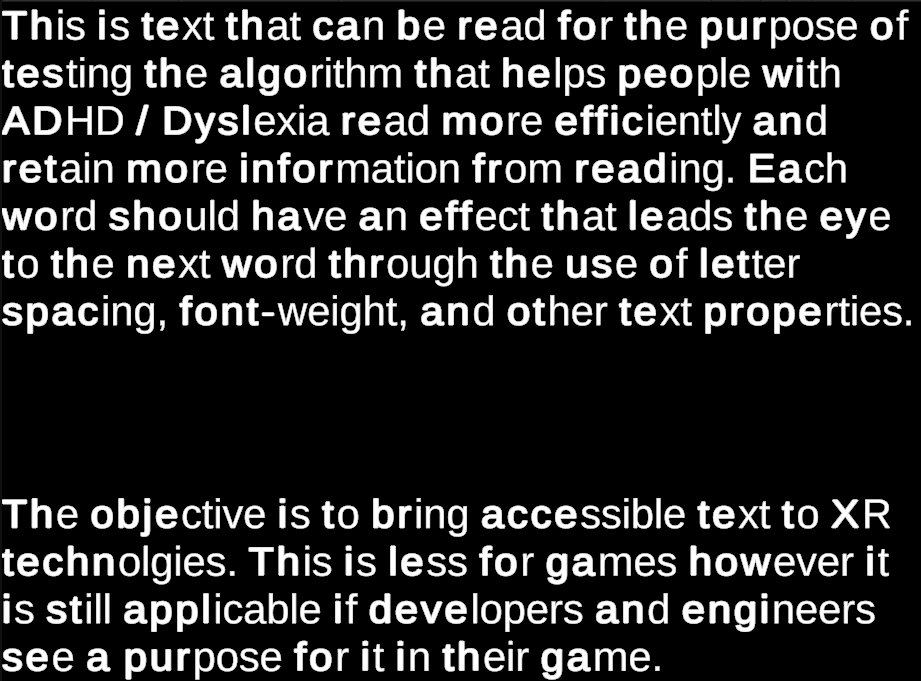

### ADHD / Dyslexia Accessible Text  

Bionic‑Style Emphasis System for Unity (with Dynamic Child‑Object Support)

This component applies a bionic‑reading‑style transformation to all TextMeshProUGUI elements under a GameObject. It bolds the first portion of each word using TextMeshPro rich‑text tags and automatically updates when new child objects are added to the hierarchy.

---

### Features

- Automatically discovers all nested `TextMeshProUGUI` components
- Applies bold emphasis to the first segment of every word
- Uses safe substring operations to avoid out‑of‑range errors
- Rebuilds text using `StringBuilder`
- Reacts to hierarchy changes through Unity’s built‑in `OnTransformChildrenChanged`
- Supports inactive UI elements
- Avoids duplicate component references

---

### How to Use

- Place on the parent `GameObject` where `TextMeshProUGUI` child components are (`Canvas` is best).
- That's it. The text will change during runtime and adapts to inactive and newly added `TextMeshProUGUI` child objects.

